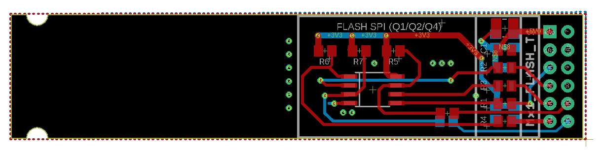
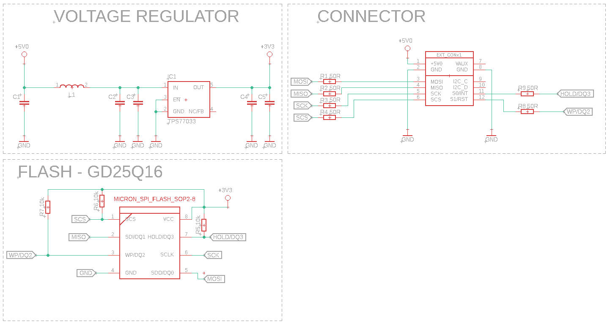

# Expansion Module: SPI Flash

## Overview
The *Expansion Module: SPI Flash* is designed for interfacing with FPGA on the SmartBoard platform. It provides an SPI interface for connecting flash memory, allowing the module to serve both as a data source and a tool for learning and testing SPI flash interfacing. The module utilizes a single socket from the SmartBoard, making it an efficient solution for expanding the board's capabilities.

### Key Features
- SPI interface for easy connection to flash memory.
- Compatible with SmartBoard's single socket interface.
- Ideal for both practical applications and educational purposes in SPI interfacing.

## Design Files

### Board Layout

### Schematic Diagram

## License
The *Expansion Module: SPI Flash* project is released under the MIT License, granting permission to use, modify, and distribute this design in both private and commercial settings.

- **Permission to Use**: You are free to use, modify, and distribute this design in both private and commercial settings.
- **Attribution Requirement**: While not required, attribution to the original author, Adam Łuczak, is appreciated. This can be done through a citation or a link back to this repository.
- **No Warranty**: This design is provided "as is", without warranty of any kind. Use it at your own risk.
- **Liability**: The author is not liable for any damages or losses that may arise from the use of this design.

For the full terms and conditions, please refer to the MIT License documentation.

## Contact
For any inquiries or suggestions about the *Expansion Module: SPI Flash* project, please feel free to contact Adam Łuczak at adam.luczak@outlook.com.
